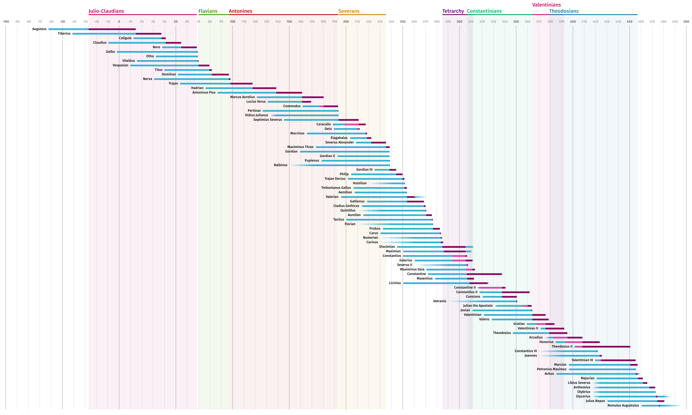

dynasty
=======

A dynamic visualization tool for dynasties and other succession timelines.
Renders dynasty timelines with life, reign and, (if applicable) reign as co-monarch.

Originally built for this visualization of the reigns of the roman emperors.

##CSV files

The visualzation is generated from 2 CSV files, a list of all emperors, and a list of all dynasties. The paths to these files can be configured in the first few lines of script.js by changing the variables **emperor_file** and **dynasty_file**.

###emperor_file

name | birth | death | ascension | abdication | ascension (co-emperor) | ascension (co-emperor)
-----|-------|-------|-----------|------------|------------------------|-----------------------
string | date | date | date or **"n"** | date or **"d"** or **"n"** | date or **"n"** | date or **"a"** or **"d"** or **"n"**
`Augustus` | `23/9/-63` | `19/8/14` | `16/1/-27` | `d` | `n` | `n`
`Valerian` | `#195` | `#260_270` | `1/10/253` | `#260` | `n` | `n`
`Constantius` | `31/3/250` | `#306` | `1/5/305` | `25/7/306` | `#293` | `a`

Explanation of optional parameters:

parameter | meaning
----------|--------
**n** | not applicable (e.g. if an emperor never served as co-emperor)
**d** | abdication date same as death date (died in office)
**a** | co-emperor abdication date same as ascension date to emperor

###dynasty_file

name of the dynasty | first emperor's name | last emperor's name | display color
--------------------|----------------------|---------------------|--------------
string | string | strng | hex color
`Julio-Claudians` | `Augustus` | `Nero` | `#c00465`
`Flavians` | `Vespasian` | `Domitian` | `#47c00a`
`Antonines` | `Nerva` | `Commodus` | `#bc0b0b`

## Date format

The date format is relatively complex because it has to account for incomplete historical records. Dates can be be expressed as *precise dates*, as *full years* (very common among roman emperors) and as *ranges of time*.

name | format | example | natural language
-----|--------|---------|-----------------
Exact date | `d/m/y` | `4/4/-34` | April 4, 34 BC
Full year | `#y` | `#-34` | At some point during 34 BC
Range between exact dates | `#d/m/y_d/m/y` | `#2/3/-11_12/7/19` | At some point between March 2, 11 BC and July 12, 19 AD
Range between full years | `#y_y` | `#-11_19` | At some point between January 1, 11 BC and December 31, 19 AD
Range between exact date and full year | `#d/m/y_y` | `#2/3/-11_19` | At some point between March 2, 11 BC and December 31, 19 AD
